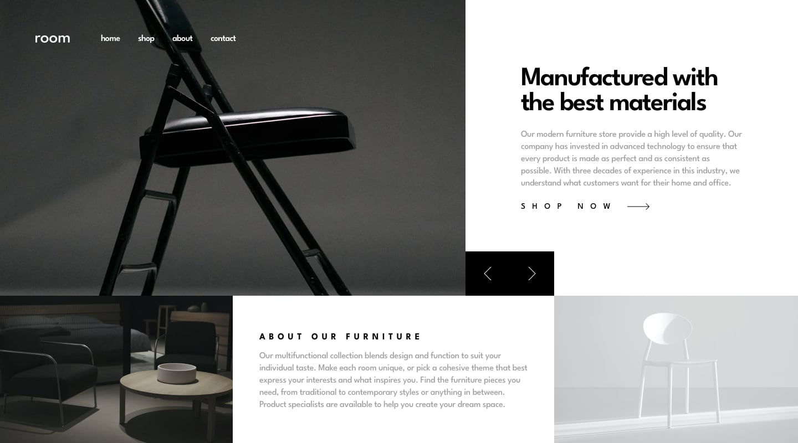
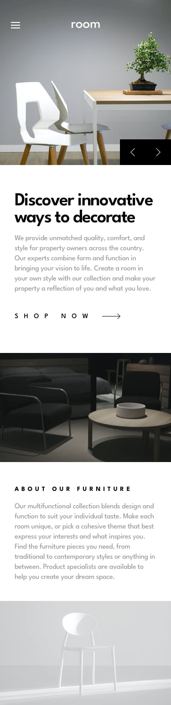

# Room Homepage

This is a solution to the Room homepage challenge on Frontend Mentor. Frontend Mentor challenges help you improve your coding skills by building realistic projects.

## Overview

### The challenge

Users should be able to:

- View the optimal layout for the site depending on their device's screen size
- See hover states for all interactive elements on the page
- Navigate the slider using either their mouse/trackpad or keyboard

### Screenshot

### Links

- Solution URL: [solution](https://github.com/Maxim-Pv/room-homepage-fm)
- Live Site URL: [live site](https://room-homepage-fm-kappa.vercel.app/)

## My process

### Built with

- Semantic HTML5 markup
- CSS custom properties
- Flexbox
- CSS Grid
- Mobile-first workfloww
- Vanilla javascript
  

### What I learned

I learned how to effectively use semantic HTML5 markup, implement responsive design with CSS Grid and Flexbox, and enhance interactivity using JavaScript.

### Continued development

I plan to continue improving my skills in responsive design and exploring more advanced features of React and Styled Components.

## Author

- Website - [Add your name here](https://www.your-site.com)
- Frontend Mentor - [Maxim](https://www.frontendmentor.io/profile/Maxim-Pv)
- LinkedIn - [Maksim Pavlov]([https://www.twitter.com/yourusername](https://www.linkedin.com/in/maksim-pavlov-12b22528b/))

## Acknowledgments

I would like to acknowledge the Frontend Mentor community for providing challenging projects that enhance my skills.

